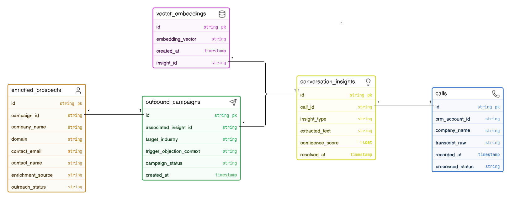

# GTM Engine: Closed-Loop Sales Conversation Memory & Outbound Agent

## 1. Executive Summary
*   **The Manual Human Workflow:** A human Account Executive conducts a sales call, manually identifies customer objections and competitor technical requirements from memory, manually captures raw notes inside a CRM, and subsequently relies on independent growth teams to cross-reference software databases for new target accounts experiencing similar technical constraints.
*   **The Agentic Automation Goal:** An event-driven, automated pipeline that ingests post-call transcripts asynchronously, utilizes an LLM processing worker to automatically extract core pain points and technical constraints into a relational database and vector embedding store, and initiates an autonomous agent loop that leverages multi-vendor data enrichment waterfalls to programmatically launch highly hyper-targeted outbound email campaigns.

---

## 2. System Architecture Diagram

---

## 3. Database Schema & Data Models

---

## 4. Component Deep Dive & JSON Payload Specs
### 4.1 Ingestion Phase (Call Transcript Webhook)
### 4.2 Processing & Memory Phase (LLM Processing & Embedding Ingestion)
### 4.3 Activation Phase (Clay Target Enrichment & Outreach Automation)

---

## 5. Failure Modes & Fault-Tolerance Engineering
*   **API Rate Limit Handling:** Implements exponential backoff with jitter on all outgoing third-party calls (Clay API, CRM writes) using a centralized token-bucket rate limiter to prevent pipeline stagnation during peak processing loads.
*   **LLM Timeout Mitigation:** The Python extraction worker wraps OpenAI/Anthropic API dispatches in a 15-second circuit breaker context; if a timeout occurs, the processing job is pushed back to the BullMQ dead-letter queue for automatic retry.
*   **Context Fragmentation Prevention:** Long audio transcripts exceeding context windows are dynamically chunked using token-bounded overlapping sliding windows, ensuring cross-chunk semantic references are fully preserved before vector embeddings are generated.
